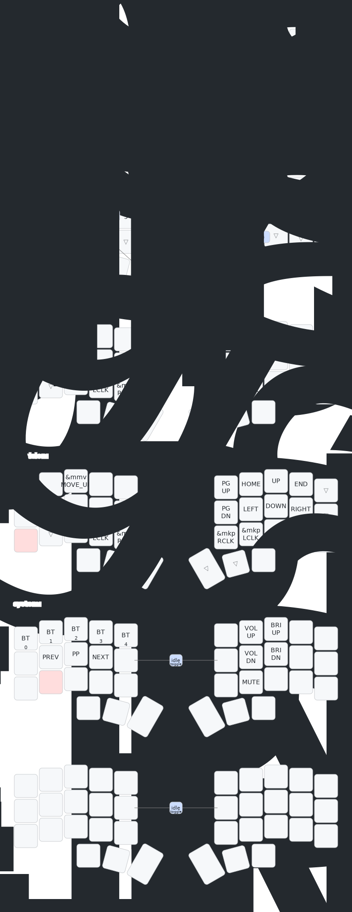

# Rei's Corne Keyboard ZMK Config

## Overview

This ZMK configuration is designed to maximise the use of home row keys for efficient
typing and navigation. It employs positional "timeless" home row mods with a tri-layer
system for accessing extended functionality.

- **Hardware:** Corne (5 columns, 36 keys) with nice!nano v2 controllers
- **Features:** Mouse emulation, positional home row mods, extensive combos, tri-layer
  system, power management

## Layout



_Diagram automatically updates when keymap changes_

## Key Features

### Layer Structure

| Layer | Index | Access | Purpose |
|-------|-------|--------|---------|
| BASE | 0 | Default | QWERTY typing with home row mods |
| EXT | 1 | Hold C/, or combos | Numbers, function keys, symbols |
| NAV | 2 | Hold D/K or combos | Arrow keys, mouse, page navigation |
| SYS | 3 | Tri-layer (EXT+NAV) | Bluetooth, media, brightness |

### Positional Home Row Mods

Uses "timeless" home row mods with opposite-hand activation:

- **Left hand (`&hl`)**: A=Shift, S=Ctrl, E=Alt, F=Cmd
- **Right hand (`&hr`)**: J=Cmd, I=Alt, L=Ctrl, ;=Shift
- **Positional filtering**: Hold only triggers when opposite-hand keys are pressed
- **Timing**: 200ms tapping term, 100ms prior idle requirement, hold-trigger-on-release

This approach virtually eliminates accidental modifier activation during normal typing.

### Navigation Layer

- **Access**: Hold `D` or `K` keys
- **Right hand**: Arrow keys, page up/down, home/end
- **Left hand**: Mouse movement and scroll control
- **Mouse buttons**: Left/right click on bottom row

### Extended Layer

- **Access**: Hold `C` or `,` keys
- **Top row**: Function keys F1-F10
- **Home row**: Numbers 1-0 with home row mods
- **Thumb keys**: Parentheses `()` and brackets `[]`

### System Layer (Tri-Layer)

- **Access**: Activate both EXT and NAV simultaneously
- **Bluetooth**: Profile selection (0-4), clear current, clear all (with Shift)
- **Media**: Previous/play-pause/next, volume up/down
- **Brightness**: Screen brightness controls

### Combo System

- **Timeout**: 35ms for responsive activation
- **Keys**: TAB, BSPC, DEL, RET, ESC, SPACE, NUBS, F11, F12
- **Active on**: BASE and EXT layers (F11/F12 on EXT only)
- **Prior idle**: 70ms default (35ms for SPACE to allow normal typing speed)

### Bluetooth Clear

Safe bluetooth clearing via hold-tap with mod-morph:

- **Hold 3 seconds**: Clear current profile
- **Hold 3 seconds + Shift**: Clear all profiles

## Power Management

- **Idle timeout**: 5 minutes before entering idle state
- **Deep sleep**: 10 minutes before entering deep sleep mode
- **Wake**: Any key press wakes keyboard from deep sleep

## Building & Flashing

### Automatic Build (Recommended)

1. Fork this repository
2. Enable GitHub Actions in your fork
3. Edit `config/corne.keymap`, `config/corne.conf`, or `build.yaml`
4. Commit and push changes
5. Download firmware `.uf2` files from Actions artifacts

### Flashing Firmware

1. Put keyboard half into bootloader mode (double-tap reset button)
2. Drag appropriate `.uf2` file to the mounted drive
3. Repeat for second half
4. Keyboards will restart with new firmware

### Creating a Release

1. Update `CHANGELOG.md` with version entry (e.g., `## [3.0.1] - 2025-12-24`)
2. Create and push a git tag:
   ```bash
   git tag 3.0.1
   git push origin 3.0.1
   ```
3. GitHub Actions will build firmware and create a release with `.uf2` files attached
